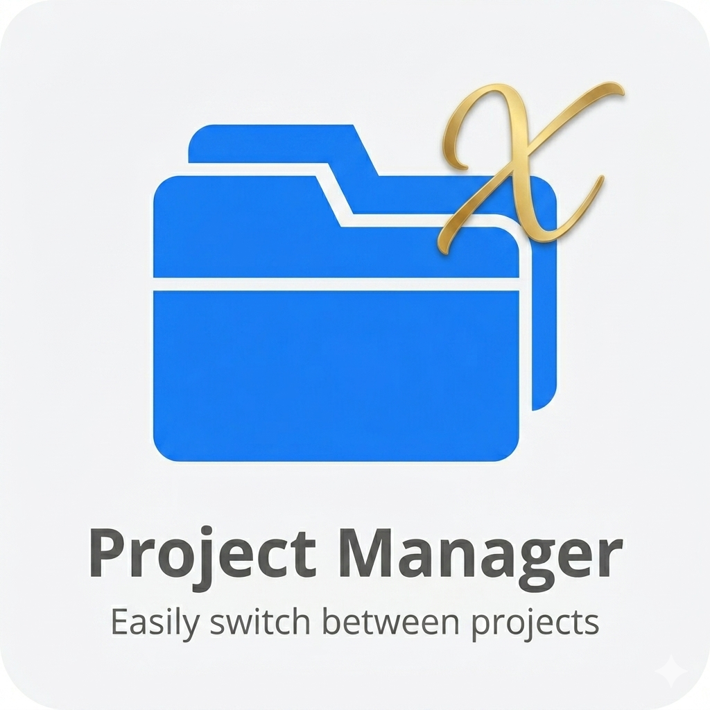

# Project Manager X

<p align="center">
  
</p>

<p align="center">
  <a href="https://marketplace.visualstudio.com/items?itemName=MaiwulanjiangMaiming.project-manager-x">
    
  </a>
  <a href="https://open-vsx.org/extension/maiwulanjiangmaiming/project-manager-x">
    
  </a>
</p>

A powerful VS Code extension for managing projects with tags, tasks, milestones, and lifecycle tracking. Import from multiple IDEs including VS Code, Trae, Cursor, and Windsurf.

## Features

- **Project Management**: Save, organize, and quickly switch between projects
- **Tags System**: Color-coded tags with drag-and-drop assignment
- **Task Management**: Create tasks with categories, priorities, and status tracking
- **Milestones**: Track project milestones with progress indicators
- **Lifecycle Tracking**: Automatic lifecycle inference (idea → planning → active → maintenance → archived)
- **Global Task View**: View and manage tasks across all projects
- **Context Snapshots**: Save and restore project context
- **Changelog**: Track project changes with versioned entries
- **Notes**: Rich text notes for each project
- **Multi-IDE Import**: Import from VS Code, Trae, Trae CN, Cursor, Windsurf
- **Custom Sorting**: Drag to reorder projects in custom mode
- **Batch Operations**: Select and delete multiple projects at once
- **Keyboard Navigation**: Full keyboard support with arrow keys and shortcuts
- ✅ **Theme Adaptation**: Automatically adapts to VS Code dark/light/high contrast themes
- ✅ **Progress Notifications**: Visual feedback for long-running operations
- ✅ **Undo Support**: Undo project deletion within 5 seconds
- ✅ **Quick Switch Enhancement**: Shows Git branch, pending tasks, and last opened time
- ✅ **Code Quality**: ESLint + Prettier + Husky pre-commit hooks
- ✅ **Test Coverage**: 65+ unit tests for core modules

## Installation

### From VS Code Marketplace

Search for **"Project Manager X"** in the Extensions view (`Cmd+Shift+X`)

### From VSIX File

1. Download the `.vsix` file from [Releases](https://github.com/MaiwulanjiangMaiming/Project-Manager-X/releases)
2. Open VS Code → Extensions (`Cmd+Shift+X`)
3. Click "..." menu → **"Install from VSIX"**
4. Select the downloaded file

## Quick Start

1. Open a workspace in VS Code
2. Click **"Save Current Project"** in the Project Manager X sidebar
3. Add tags to organize your projects
4. Create tasks and milestones to track progress

## Usage

### Managing Projects

- **Save Project**: Click the save button to add the current workspace
- **Open Project**: Click on a project to open it
- **Reorder**: Drag projects to reorder (switches to Custom sort mode)
- **Batch Delete**: Click "Manage" → select projects → "Delete Selected"

### Tags

- **Create Tag**: Click "+" in the tags section
- **Edit Tag**: Hover over a tag and click the pencil icon
- **Assign Tag**: Drag a project onto a tag
- **Remove Tag**: Drag a project onto an already-assigned tag

### Tasks

- **Create Task**: Open a project → Tasks tab → "New Task"
- **Categories**: bug, feature, refactor, docs, research, chore, experiment
- **Priorities**: critical, high, medium, low
- **Status**: backlog, todo, in_progress, review, done, blocked, cancelled

### Import from Other IDEs

1. Click "Import from Project Manager"
2. Select the IDE (VS Code, Trae, Cursor, etc.)
3. Choose which projects to import

## Configuration

```json
{
  "projectManagerPro.autoDetect": true,
  "projectManagerPro.showGitStatus": true,
  "projectManagerPro.compactView": false,
  "projectManagerPro.enableReminders": true
}
```

## Architecture

```
Project-Manager-X/
├── src/
│   ├── __tests__/            # Unit tests (65+ tests)
│   ├── __mocks__/            # VS Code API mocks
│   ├── extension.ts          # Main entry
│   ├── core/                 # Core modules
│   │   ├── storage.ts        # Data persistence
│   │   ├── projectManager.ts # Business logic
│   │   ├── container.ts      # Dependency injection
│   │   ├── migrations.ts     # Data migrations
│   │   ├── backup.ts         # Auto backup
│   │   ├── smartWatcher.ts   # File watching
│   │   ├── statusBar.ts      # Status bar integration
│   │   └── reminderSystem.ts # Task reminders
│   ├── commands/             # Command handlers
│   ├── types/                # Type definitions
│   └── webview/              # React frontend
│       ├── store/            # Zustand state
│       ├── rpc/              # Type-safe RPC
│       ├── components/       # UI components
│       └── styles/           # CSS
├── build.js                  # Build script
└── package.json
```

## Keyboard Shortcuts

| Key          | Action                  |
| ------------ | ----------------------- |
| `↑` / `↓`    | Navigate projects       |
| `Enter`      | Open selected project   |
| `Ctrl+Enter` | Open in new window      |
| `Delete`     | Delete selected project |
| `/`          | Focus search            |
| `Escape`     | Clear search / go back  |

## Feedback & Reviews

If you find Project Manager X Pro helpful, please consider leaving a review on the [VS Code Marketplace](https://marketplace.visualstudio.com/items?itemName=MaiwulanjiangMaiming.project-manager-x) or [Open VSX](https://open-vsx.org/extension/maiwulanjiangmaiming/project-manager-x). Your feedback helps improve the extension and reach more developers. Found a bug or have a feature idea? [Open an issue](https://github.com/MaiwulanjiangMaiming/Project-Manager-X/issues) — every suggestion matters!

## Contributing

Contributions welcome! Please read our [contributing guidelines](https://github.com/MaiwulanjiangMaiming/Project-Manager-X/blob/main/CONTRIBUTING.md).

## License

GPL-3.0 License

## Contact

For feature requests or bug reports:

- [GitHub Issues](https://github.com/MaiwulanjiangMaiming/Project-Manager-X/issues)
- Email: mawlan.momin@gmail.com

---

**Enjoy managing your projects!**
